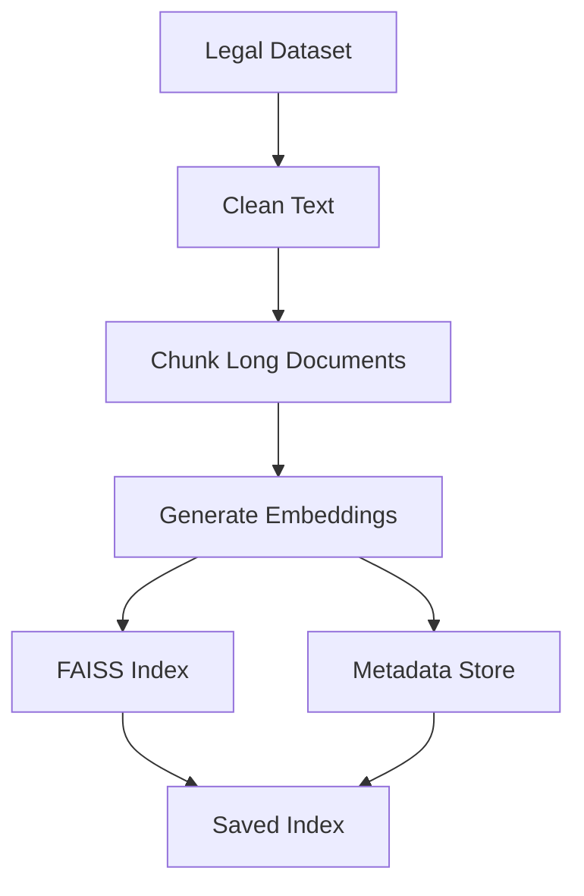

# NayayaLLM — Legal Document Intelligence System

NayayaLLM is an **applied research–grade Legal NLP system** that enables **document-conditioned question answering** and **multi-granular summarization** over long legal judgments using **Retrieval-Augmented Generation (RAG)**.

The system is designed to handle **real-world legal documents**, addressing challenges such as long context length, hallucination control, and deployment constraints.

---

## 🔍 Key Capabilities

- 📄 Upload or paste long legal documents (judgments, FIRs, orders)
- ❓ Ask questions grounded strictly in the uploaded document
- 🧩 Generate **section-wise summaries**
- 📘 Generate **complete document summaries**
- 🔎 FAISS-based semantic retrieval to reduce hallucination
- ⚙️ Production-ready FastAPI backend

---

## 🏗️ System Architecture

📌 **Diagram 1 — Overall System Architecture**

```mermaid
flowchart LR
    User -->|Upload File / Paste Text| Frontend
    Frontend -->|FormData API Call| FastAPI
    FastAPI -->|Route by Mode| Controller

    Controller -->|QA| RAG_Pipeline
    Controller -->|Section Summary| Section_Summarizer
    Controller -->|Full Summary| Full_Summarizer

    RAG_Pipeline --> FAISS
    RAG_Pipeline --> LLM

    Section_Summarizer --> LLM
    Full_Summarizer --> LLM

    LLM --> FastAPI
    FastAPI --> Frontend
    Frontend --> User
 ```

## 🧠 Upload-Based RAG Pipeline

The core innovation of NayayaLLM is Upload-Based RAG, where retrieval is performed only on the user-provided document, ensuring answers remain grounded and legally accurate.

📌 **Diagram 4 — Upload-Based RAG Pipeline**
```mermaid
flowchart LR
    A[Uploaded Document] --> B[Text Extraction]
    B --> C[Chunking]
    C --> D[Embedding Generation]
    D --> E[FAISS Index]

    Q[User Query] --> F[Query Embedding]
    F --> E

    E --> G[Top-K Chunks]
    G --> H[Context Assembly]
    H --> I[LLM Answer Generation]
```
## 📚 Knowledge Base Creation (Offline Pipeline)

Embeddings are treated as derived artifacts, not source code.
They are generated offline and loaded at runtime for retrieval.

📌 **Diagram 5 — Knowledge Base Creation Pipeline**


## 🧪 Supported Modes

| Mode | Description |
|------|-------------|
| `qa` | Answer questions grounded strictly in the uploaded document |
| `section` | Generate section-wise legal summaries |
| `summary` | Generate a complete document summary |

---

## 🛠️ Tech Stack

- **Backend:** FastAPI  
- **Retrieval:** FAISS  
- **Embeddings:** SentenceTransformers  
- **LLM Inference:** Groq API  
- **Frontend:** React (Firebase / Vercel compatible)  
- **Version Control:** Git + Git LFS (for embeddings)

---

## 🚀 Running the Backend Locally

```bash
pip install -r requirements.txt
python -m app.main
```

*Backend runs at:
```bash
http://localhost:8000
```

*Swagger UI:
```bash
http://localhost:8000/docs
```

📦 Embeddings & Artifacts

- FAISS embeddings are large binary artifacts and are handled using Git LFS.

- Source legal texts are version-controlled

- Embeddings are generated using:
```bash
python -m scripts.build_kb
```

- This avoids bloating Git history and follows ML best practices

## ⚠️ Limitations

- Summarization quality depends on LLM context limits

- No large-scale automatic evaluation yet (manual analysis used)

- Optimized for correctness over speed

## 📌 Project Classification

**Type**: Applied Research Project

**Focus**: Legal NLP, RAG systems, long-document processing

**Audience: AI/ML engineering roles, applied research internships

## 👤 Author

**Rakshit Gupta**
Applied AI / ML Engineer
Focus areas: NLP systems, RAG, deployment under constraints
